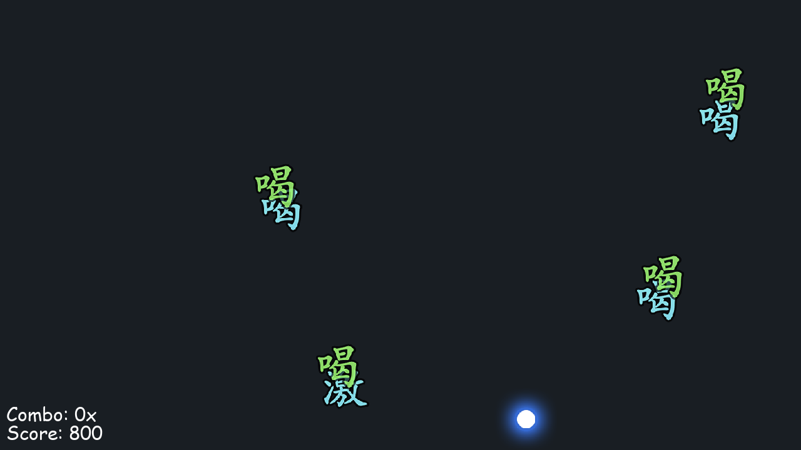

# CTB CLONE PYGAME

*by Aaron Zhang A01316218*

**future feature todo**
  - graphical stage selection
  - sort, filter, delete functionality in Flask app
  - better stage creation / editing
  - variable movement speed and fall speed modifiers

## Controls

**A / Left Arrow** - move left

**D / Right Arrow** - move right

**Left Shift** - boost

## Gameplay

Catch the points as they fall from the top of the screen.

Different points are worth different score values:

**310 points**

**300 points**

**100 points**

Try to maintain your combo by catching points without missing any.
